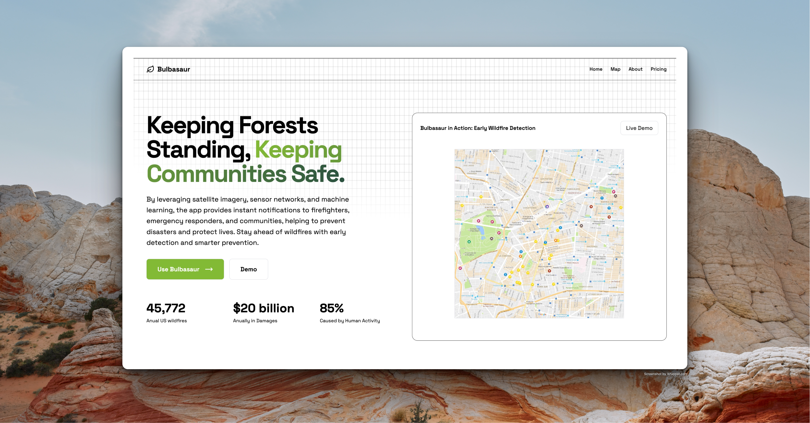
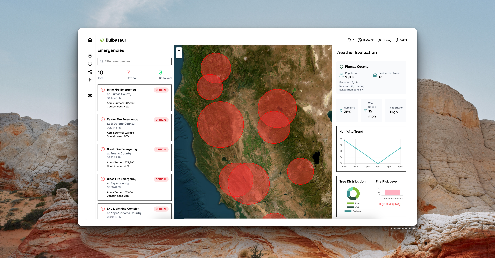
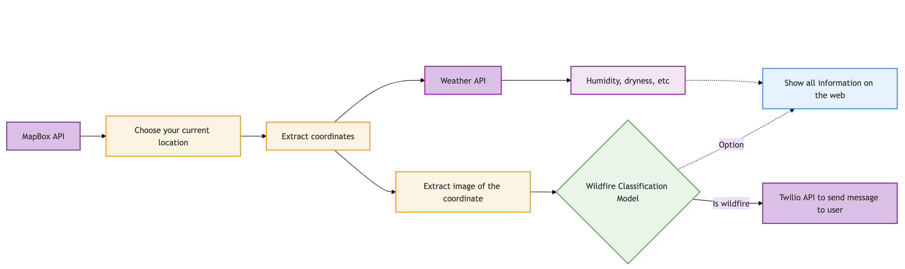

# 🌱 Bulbasaur - a Real-time AI-powered Wildfire Monitoring System

## Overview

An advanced AI-powered system for real-time wildfire detection using satellite imagery and environmental data analysis. The system combines computer vision technology with weather data to provide comprehensive wildfire risk assessment and early detection capabilities.

## 🎯 Key Features

- Real-time satellite image analysis for wildfire detection
- Weather condition monitoring and risk assessment
- 95% accuracy in wildfire detection
- Comprehensive risk rating system
- Live coordinate-based weather data integration

### Machine Learning Model & Pipeline

- Convolutional Neural Network (CNN) for image classification
- Trained on 2000+ images
- 95% detection accuracy
- Multi-dataset training approach

### Datasets

1. **VisDrone2019-DET Dataset**

   - Aerial imagery dataset
   - High-resolution drone captures
   - [Dataset Link](https://huggingface.co/datasets/Voxel51/VisDrone2019-DET)

2. **Wildfire Prediction Dataset**
   - Specialized wildfire imagery
   - Ground truth annotations
   - [Dataset Link](https://www.kaggle.com/datasets/abdelghaniaaba/wildfire-prediction-dataset)

### Weather Analysis

- Real-time weather API integration
- Location-based weather data retrieval
- Environmental condition assessment
- Risk factor calculation

## 📊 Performance Metrics

- Model Accuracy: 95%
- Training Dataset Size: 2000+ images
- Real-time Processing Capability
- Weather Data Update Frequency: Real-time

## 🛠️ Technology Stack

- Python (Machine Learning & Backend)
- TensorFlow/PyTorch (Deep Learning)
- React.js (Frontend) + MapBox API
- Weather API Integration
- Satellite Image Processing Libraries

## 📝 License

This project is licensed under the MIT License - see the [LICENSE.md](LICENSE.md) file for details.

## 👥 Team

- Luan Nguyen - Full-stack Developer
- Nga Vu - ML Engineer
- Smit Devrukhkar - Full-stack Developer
- Andy Le - Full-stack Developer

## 🙏 Acknowledgments

- [VisDrone Team](https://github.com/VisDrone/VisDrone-Dataset) for their comprehensive drone imagery dataset
- Kaggle community for the Wildfire Prediction Dataset
- Weather API providers for real-time environmental data

---
